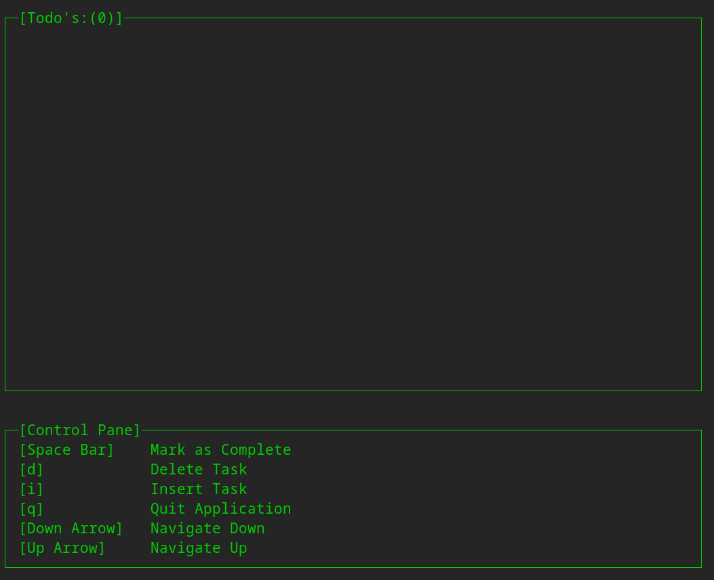
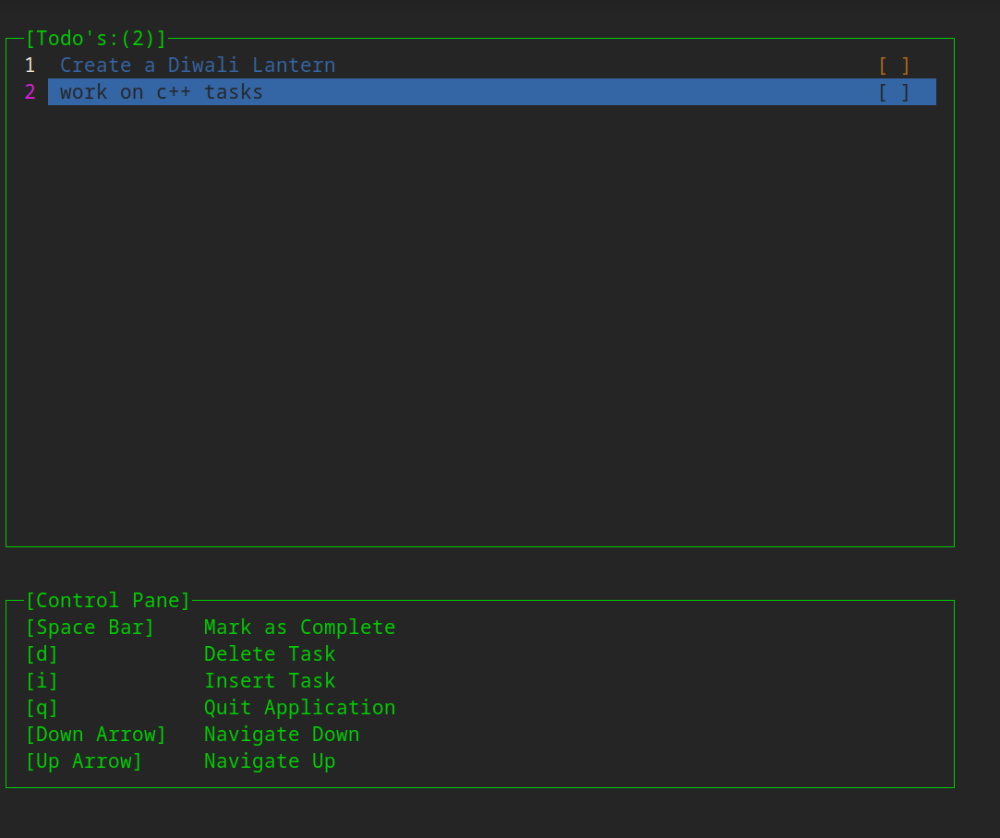
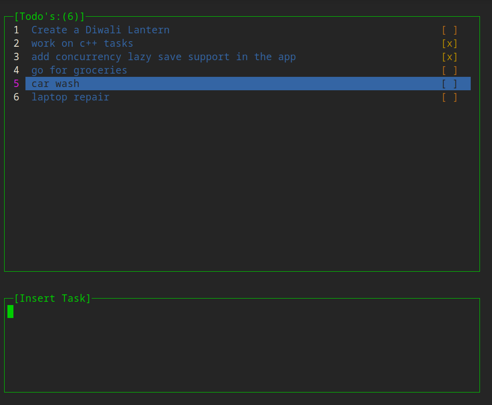
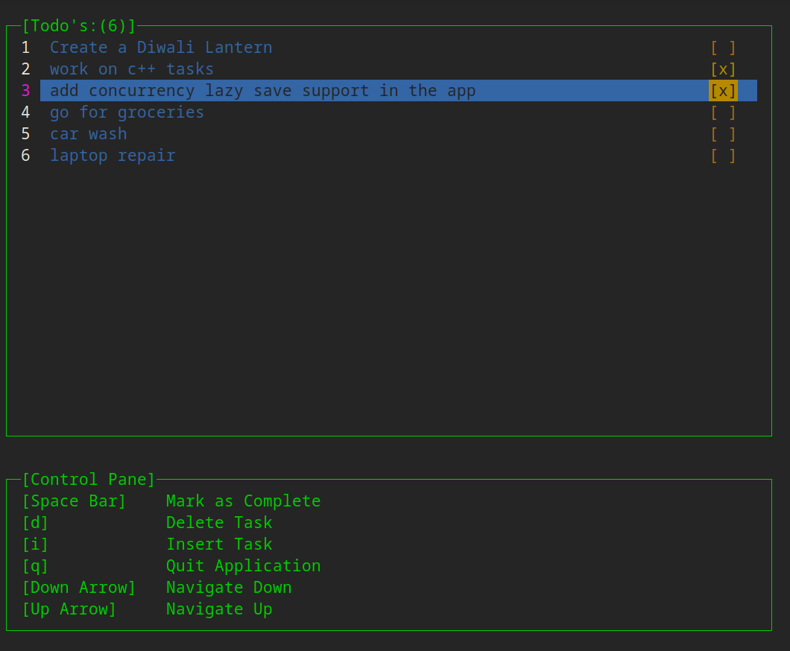

# Terminal GUI Todo App 
This application is created for Capstone project in Udacity Nanodegree C++ Program. This project is a todo application which uses ncurses to make Terminal GUI possible. 
However there is a caveat one cannot have a good experince of the app in small terminal window. So it is suggested to have near fullscreen. 
There are few features which are yet to be implemented and will be mentioned in the TODO section below.
## Dependencies for Running Locally
* cmake >= 3.5
* make >= 4.1 (Linux, Mac), 3.81 (Windows)
* gcc/g++ >= 5.4
* ncurses > 5

## Instructions for Building the Project
- Clone this repo.
- ncurses installation (optional if ncurses is not installed) 
  - install `sudo apt-get install libncurses6-dev libncursesw6`
- Make a build directory in the top level directory by: `mkdir build && cd build`.
- Compile by: `cmake .. && make`.

## Instructions for Running the Project
1. With the build done, run the executable `./todo`
2. The terminal window will take over full terminal screen and one can see  

3. As you can see on screen in `Control Pane` section here are the functionalities 
    - Insert A Task
        - One can use `i` key to initiate insert of the Task. 
        - Once clicked one can see the `Control Pane` is replaced with `Insert Task` screen with a blinking cursor ready    
        to take task details. 
        - Press `Enter` once done entering details.
    - Navigate Along the tasks
        - one can use `Up Arrow` & `Down Arrow` to navigate along the tasks.  
          one can see task getting highlighted based on the arrow movement action. 
    - Delete A Task
        - One can use `d` key to delete a task that is being highlighted on screen
    - Mark as Complete
        - One can use `Space Bar` on highlighted task to toggle the task as complete/in-complete and   
        on UI it will shown as `[x]` for marked tasks. 
## Screenshots:

## Overview of Code Structure
1. Code structure follows a pattern of creating separate directory for header & source files. 
2. The project adheres Object Oriented Design and take into account some of the SOLID principles like Single  
Responsibility Principle 
3. The high-level flow of the code is as described below
   - The program starts from `main.cpp` as entry point.
   - `WindowManager` has some static functions like `initializeScreens` which initializes screen and `ncurses` with  
   colors respective windowing setups
   - And instance of `TaskManager` is created and internally holds the logic of showing windows & taking the inputs  
    and display of tasks.
   - if user selects to quit, `WindowManager` will `terminateScreens` and controls appropriately. 
4. Details of `WindowManager`
   - `Windows` is abstraction created to encapsulate window pane that we get to see on UI. This takes into account  
    features like getting taking the dimensions of the window and position on which it can be shown. Adding proper support  
    for `draw`ing the screen. Since ncurses is a terminal GUI library. repainting UI on each data change event is vital 
   - `WindowManager` is a abstraction to hold reference of all the windows on screen and whenever can be used for  
     cross-window operations like `repaintWindows`.
   - Since `WindowManager` is all about windows in the application it even takes into accounts all the needfuls things 
    that needs to be done to initialize windowing capabilities & clears them once application shut-down. 
    `terminateScreen` & `initializeScreen`   
5. Details of `TaskManager`
   - `TaskItem` is a fundamental entity in the design of todo which holds the details of task.
   - `DataList` is an entity which holds all the `TaskItem`'s into it and operations such as `addTask`, `deletTask`  
   can be done. 
   - `TaskManager` at high-level holds the responsibility of creating windows for displaying tasks & taking inputs.  
   `TaskManager` also holds a responsibility to stitch a functionality of storing & loading tasks from disk. All of  
   responsibilities are glued with respective class to make sure we have separation of concerns.    
6. Details of `TaskPersistance`
   - Holds a responsibility of loading data into datalist & storing data from datalist to disk.
7. Details of `Window` & `InputWindow`
   - Input window adds functionality of putting an input prompt in an window and takes all the `window` features.
   It could have been a candidate of inheritance but perfered to used composition for better OO design. 
8. Details of `TextContent`
   - On UI we need a entity which will show text-content of UI and encapsulate various formatting, positioning features. 
## Information about Rubric & Criteria
### Loops, Functions, I/O
  - The project demonstrates an understanding of C++ functions and control structures. 
    - References: all files.
  - The project reads data from a file and process the data, or the program writes data to a file. 
    - References: [TaskPersistence.h] & [TaskPersistence.cpp].
  - The project accepts user input and processes the input. 
    - References: [TaskManager.h]  `addPromotControls` to take user inputs. 
    
### Object Oriented Programming
  - The project uses Object Oriented Programming techniques. 
    - Code is organized to take OO design in account.
  - Classes use appropriate access specifiers for class members. 
    - Since not using properties for holding data on parent under inheritance chain, din't got a case to use `protected`.
  - Class constructors utilize member initialization lists.  
    - References: [TaskItem.cpp]
  - Classes abstract implementation details from their interfaces. 
    - Classes takes into account contracts for data sharing across.
  - Classes encapsulate behavior. 
    - Classes have behaviours encapsulated and exposed only relevant abstractions.
  - Classes follow an appropriate inheritance hierarchy. 
    - Composition is used in cases like [InputWindow.h] & [Window.h]. Was in need of a generic class for serializing  
      functionality. Used pure virtual functions in [Serializable.h].
  - Overloaded functions allow the same function to operate on different parameters.
    - used constructor overloading under [TaskItem.h]
  - Derived class functions override virtual base class functions.
    - class named `TaskItemSerializer` under [TaskItem.h]  
  - Templates generalize functions in the project.
    - used in [Serializable.h] for defining generic definitions of serializing behaviour. 

### Memory Management
   - The project makes use of references in function declarations.
     - used references at places where same data is shared across. example: [Datalist.h] `addTask(&string)`
   - The project uses smart pointers instead of raw pointers.
     - used smart pointers extensively at places where data is owned under composition by entities. 
      [TaskManager.h],[DataList.h], [InputWindow.h], [TextContent.h] 
   - The project follows the Rule of 5.
     - used in [TaskItem.h]
   - The project uses move semantics to move data, instead of copying it, where possible.
     - used in [TaskItem.h]
   - The project uses destructors appropriately.
     - had to use in [Window.h] to manage ncurses windows and din't had a need to use at other places,  
     since used smart pointers.
     
 ## Concurrency
   - Project doesn't use concurrency at the moment, since din't found any associated use-case.